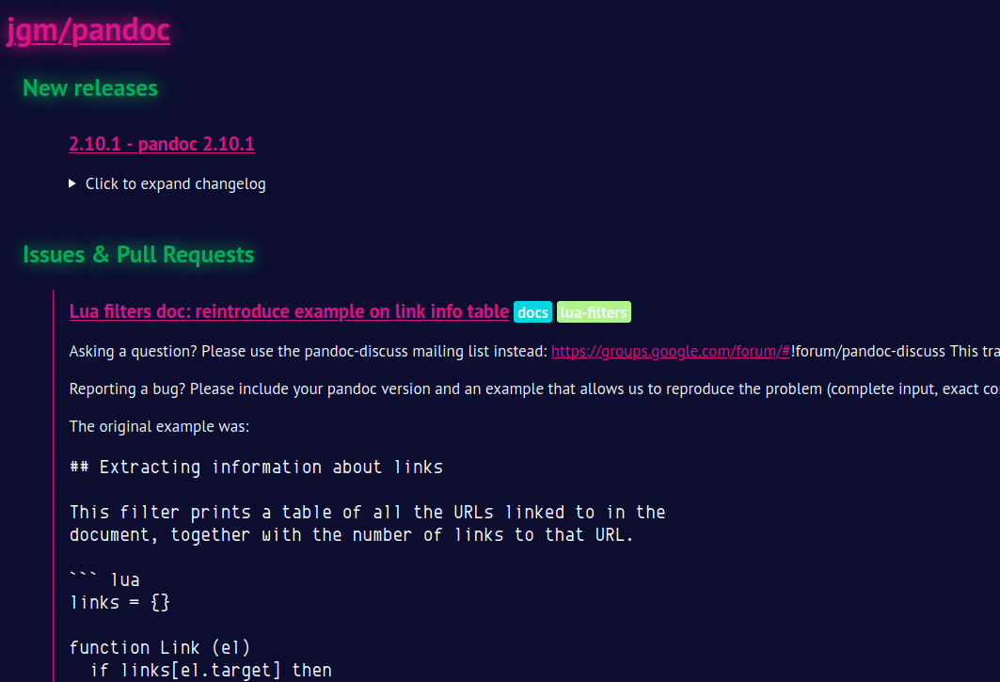

# [Hyades](https://hyades.info)

[Hyades](http://hyades.info) is a weekly newsletter containing a summary of everything that happened in your starred Github repos.

## Why?

I developed Hyades to follow all the Github projects I wanted to keep an eye on, but which would clutter my notifications & inbox if I watched every single on of them. As a comfortable middle-ground, Hyades will deliver every Monday a quick rundown, customisable in scope, of everything of importance that happened the past week.

## Development

Hyades is developed on the [OTP](https://erlang.org/doc/design_principles/users_guide.html) with [Elixir](https://elixir-lang.org/) using the [Phoenix framework](https://www.phoenixframework.org/). All dependencies are listed in the [Mix file](mix.exs).

To start hacking on your own Hyades instance:

  * Configure your database secrets in `config/dev.exs`
  * Setup the project with `mix setup`
  * Install the JS buils pipeline with `npm install --prefix ./assets`
  * Start Phoenix endpoint with `mix phx.server`

You can now visit [`localhost:4000`](http://localhost:4000) from your browser.

## Self Hosting

### Create a Github App

You must first [create a Github app](https://developer.github.com/apps/building-github-apps/creating-a-github-app/), which will give you a token to give access to the Github API to your deployment of Hyades, with the callback URL set to `https://YOUDOMAIN.FQDN/ROOT/github/back`. Once done, fill the required data (app ID and token) in `config/{dev,prod}.exs`.

### Deploy Hyades

Hyades is deployed like any other Phoenix application. You will have to fill your secrets in `config/prod.secret.exs`, then follow the [Pow production checklist](https://hexdocs.pm/pow/production_checklist.html#content) and the [Phoenix deployment guide](https://hexdocs.pm/phoenix/deployment.html).

## License

Hyades is developed & distributed under the [CeCILL-C](https://en.wikipedia.org/wiki/CeCILL) license (LGPL-compatible).
